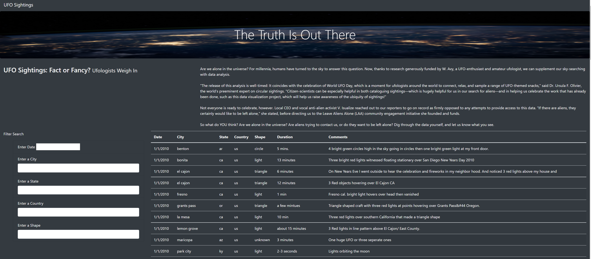
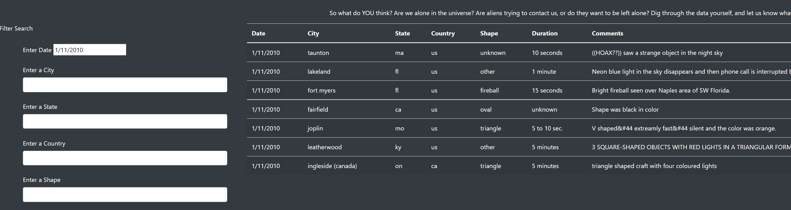
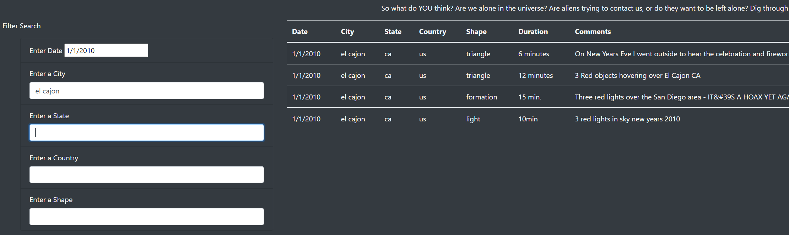
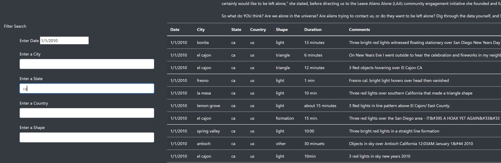
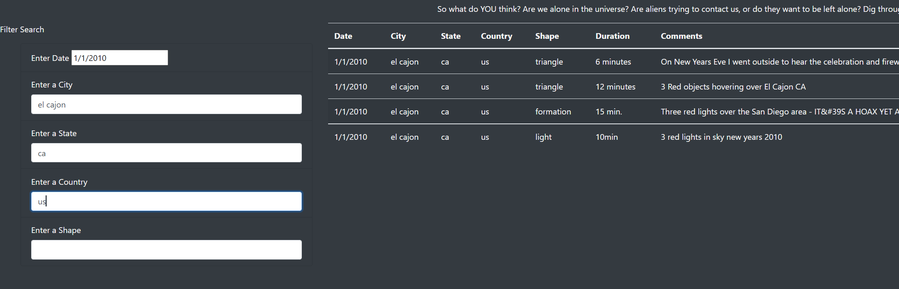
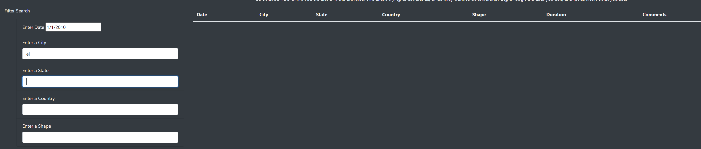

# UFOs
## Overview of Project: 
UFOs project uses JavaScript, HTML, and CSS to create a custom webpage that show cases different UFO sightings around the world. We perform a high level of customization to deliever visual data by using JavaScript. Our goal is to create a dynamic filter table to provide user-friendly advance search.
## Results: 
Main page shows:

1. Enter a Date to search the UFOs sightings:

2. Enter a City to filter our the unrelated cities:

3. If you don't know the city's name, try to enter the State that you know:

4. Use Multiple criteria to search specific data:

## Summary: 
As we adding more search criteries, the results might not have any finding due to inefficiency,such as miss spelling or typing error. For example, if a user trys to search a city **el cajon**, however, she is only tryping **el** instead, the result will not show:

### Furture Development
We can optimize our search engine in order to improve the advance search efficiency. 
- Add a set of clicking buttons to filter our data. 
- Using typing auto-correction choice to prevent miss-spelling issue
- Using matching typing character function to display data results.
